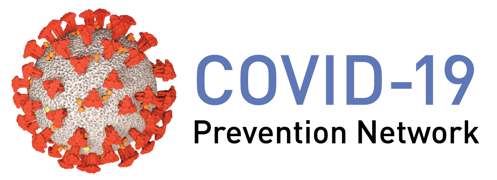

```{r include=FALSE, cache=FALSE}
library(methods)
library(dplyr)
library(kyotil)
set.seed(98109)

###############################################################################
# reading in data set
###############################################################################
# NOTE: `data_in_file` must exist in the top-level data_raw subdirectory
data_in_file <- "COVID_VEtrial_practicedata_primarystage1.csv"
data_name <- "practice_data.csv"
study_name <- "mock"

###############################################################################
# define immune markers to be included in the analysis
###############################################################################

assays <- c(
  "bindSpike", "bindRBD", "pseudoneutid50", "pseudoneutid80"
  # NOTE: the live neutralization marker will eventually be available
  #"liveneutmn50"
)

# if this flag is true, then the N IgG binding antibody is reported 
# in the immuno report (but is not analyzed in the cor or cop reports).
include_bindN <- TRUE

# times of measurements of the markers
# B, Day29, Day57 are quantitative levels of markers measured at different times
# DeltaXoverY is fold change in marker from time X to time Y
times <- c("B", "Day29", "Day57", 
           "Delta29overB", "Delta57overB", "Delta57over29")

# limits for each assay
llods <-c(bindN = 20, 
          bindSpike = 20, 
          bindRBD = 20, 
          pseudoneutid50 = 10, 
          pseudoneutid80 = 10, 
          liveneutmn50 = 62.16)

lloqs <-c(bindN = 34, 
          bindSpike = 34, 
          bindRBD = 34, 
          pseudoneutid50 = 49, 
          pseudoneutid80 = 43, 
          liveneutmn50 = 117.35) 

uloqs <-c(bindN = 19136250, 
          bindSpike = 19136250, 
          bindRBD = 19136250, 
          pseudoneutid50 = Inf, 
          pseudoneutid80 = Inf, 
          liveneutmn50 = 18976.19) 

###############################################################################
# figure labels and titles for markers
###############################################################################
has29 = "Day29" %in% times

markers <- c(outer(times[which(times %in% c("B", "Day29", "Day57"))], 
                   assays, "%.%"))

# race labeling
labels.race <- c(
  "White", "Black or African American",
  "Asian", "American Indian or Alaska Native",
  "Native Hawaiian or Other Pacific Islander", "Multiracial",
  "Other", "Not reported and unknown"
)

# ethnicity labeling
labels.ethnicity <- c(
  "Hispanic or Latino", "Not Hispanic or Latino",
  "Not reported and unknown"
)

labels.assays.short <- c("Anti N IgG (IU/ml)", 
                         "Anti Spike IgG (IU/ml)", 
                         "Anti RBD IgG (IU/ml)", 
                         "Pseudovirus-nAb ID50", 
                         "Pseudovirus-nAb ID80", 
                         "Live virus-nAb MN50")
names(labels.assays.short) <- c("bindN",
  "bindSpike",
  "bindRBD",
  "pseudoneutid50",
  "pseudoneutid80",
  "liveneutmn50")

# hacky fix for tabular, since unclear who else is using
# the truncated labels.assays.short later
labels.assays.short.tabular <- labels.assays.short

labels.time <- c("Day 1", "Day 29", "Day 57", 
                 "D29 fold-rise over D1", 
                 "D57 fold-rise over D1", 
                 "D57 fold-rise over D29")

names(labels.time) <- c("B", "Day29", "Day57", "Delta29overB", 
                        "Delta57overB", "Delta57over29")

# axis labeling
labels.axis <- outer(
  rep("", length(times)),
  labels.assays.short[assays],
  "%.%"
)
labels.axis <- as.data.frame(labels.axis)
  rownames(labels.axis) <- times

labels.assays <- c("Binding Antibody to Spike", 
                   "Binding Antibody to RBD",
                   "PsV Neutralization 50% Titer",
                   "PsV Neutralization 80% Titer",
                   "WT LV Neutralization 50% Titer")

names(labels.assays) <- c("bindSpike", "bindRBD", "pseudoneutid50",
                          "pseudoneutid80",
                          "liveneutmn50")

# title labeling
labels.title <- outer(
  labels.assays[assays],
  ": " %.%
    c(
      "Day 1", "Day 29", "Day 57", "D29 fold-rise over D1",
      "D57 fold-rise over D1", "D57 fold-rise over D29"
    ),
  paste0
)
labels.title <- as.data.frame(labels.title)
colnames(labels.title) <- times
# NOTE: hacky solution to deal with changes in the number of markers
rownames(labels.title)[seq_along(assays)] <- assays
labels.title <- as.data.frame(t(labels.title))

# creating short and long labels
labels.assays.short <- labels.axis[1, ]
labels.assays.long <- labels.title

# baseline stratum labeling
Bstratum.labels <- c(
  "Age >= 65",
  "Age < 65, At risk",
  "Age < 65, Not at risk"
)

# baseline stratum labeling
demo.stratum.labels <- c(
  "Age >= 65, URM",
  "Age < 65, At risk, URM",
  "Age < 65, Not at risk, URM",
  "Age >= 65, White non-Hisp",
  "Age < 65, At risk, White non-Hisp",
  "Age < 65, Not at risk, White non-Hisp"
)

###############################################################################
# theme options
###############################################################################

# fixed knitr chunk options
knitr::opts_chunk$set(
  comment = "#>",
  collapse = TRUE,
  out.width = "80%",
  out.extra = "",
  fig.pos = "H",
  fig.show = "hold",
  fig.align = "center",
  fig.width = 6,
  fig.asp = 0.618,
  fig.retina = 0.8,
  dpi = 300,
  echo = FALSE,
  message = FALSE,
  warning = FALSE
)

# global options
options(
  digits = 6,
  #scipen = 999,
  dplyr.print_min = 6,
  dplyr.print_max = 6,
  crayon.enabled = FALSE,
  bookdown.clean_book = TRUE,
  knitr.kable.NA = "NA",
  repos = structure(c(CRAN = "https://cran.rstudio.com/"))
)

# no complaints from installation warnings
Sys.setenv(R_REMOTES_NO_ERRORS_FROM_WARNINGS="true")

# overwrite options by output type
if (knitr:::is_html_output()) {
  #options(width = 80)

  # automatically create a bib database for R packages
  knitr::write_bib(c(
    .packages(), "bookdown", "knitr", "rmarkdown"
  ), "packages.bib")
}
if (knitr:::is_latex_output()) {
  #knitr::opts_chunk$set(width = 67)
  #options(width = 67)
  options(cli.unicode = TRUE)

  # automatically create a bib database for R packages
  knitr::write_bib(c(
    .packages(), "bookdown", "knitr", "rmarkdown"
  ), "packages.bib")
}

# create and set global ggplot theme
# borrowed from https://github.com/tidymodels/TMwR/blob/master/_common.R
theme_transparent <- function(...) {
  # use black-white theme as base
  ret <- ggplot2::theme_bw(...)

  # modify with transparencies
  trans_rect <- ggplot2::element_rect(fill = "transparent", colour = NA)
  ret$panel.background  <- trans_rect
  ret$plot.background   <- trans_rect
  ret$legend.background <- trans_rect
  ret$legend.key        <- trans_rect

  # always have legend below
  ret$legend.position <- "bottom"
  return(ret)
}

library(ggplot2)
theme_set(theme_transparent())
theme_update(
  text = element_text(size = 25),
  axis.text.x = element_text(colour = "black", size = 30),
  axis.text.y = element_text(colour = "black", size = 30)
)

# custom ggsave function with updated defaults
ggsave_custom <- function(filename = default_name(plot),
                          height= 15, width = 21, ...) {
  ggsave(filename = filename, height = height, width = width, ...)
}
```


```{r, include = knitr::is_latex_output() & study_name == "mock"}
knitr::asis_output("\\AddToShipoutPictureFG{
  \\AtPageCenter{
    \\makebox[0pt]{\\rotatebox[origin=c]{45}{
      \\scalebox{10}{\\texttransparent{0.3}{MOCK}}}}}}")
```

`r if (knitr::is_latex_output()) '<!--'`

# CoVPN Correlates Analysis Report {-}


<p style="clear: both;">
<br>

## Statistical Analysis Plan {-}

The SAP is available at https://doi.org/10.6084/m9.figshare.13198595

## Reproducibility Notice {-}

This project integrates the virtual environments framework provided by [the
`renv` package](https://rstudio.github.io/renv/) for computational
reproducibility. By taking this approach, all results are generated using a
consistent versioning of both R and several R packages. This version of the
report was built with `r R.version.string`, [pandoc](https://pandoc.org/)
version `r rmarkdown::pandoc_version()`, and the following R packages:

```{r pkg-list, echo=FALSE, results="asis"}
# borrowed from https://github.com/tidymodels/TMwR/blob/master/index.Rmd
deps <- desc::desc_get_deps()
pkgs <- sort(deps$package[deps$type == "Imports"])
pkgs <- sessioninfo::package_info(pkgs, dependencies = FALSE)
df <- tibble::tibble(
  package = pkgs$package,
  version = pkgs$ondiskversion,
  source = gsub("@", "\\\\@", pkgs$source)
)
knitr::kable(df, format = "markdown")
```

To get started with using this project and its `renv` package library, we
first recommend briefly reviewing the [`renv` collaboration
guide](https://rstudio.github.io/renv/articles/collaborating.html).

`r if (knitr::is_latex_output()) '-->'`

<!--chapter:end:index_riskscore.Rmd-->

---
header-includes:
   - \usepackage{float}
output:
  pdf_document: default
  html_document: default
  citation_package: natbib
  number_sections: true
  extra_dependencies: ["caption", "subcaption", "graphicx"]
  toc: true
---
```{r include=FALSE, cache=FALSE}
library(methods)
library(dplyr)
library(kyotil)
set.seed(98109)

###############################################################################
# reading in data set
###############################################################################
# NOTE: `data_in_file` must exist in the top-level data_raw subdirectory
data_in_file <- "COVID_VEtrial_practicedata_primarystage1.csv"
data_name <- "practice_data.csv"
study_name <- "mock"

###############################################################################
# define immune markers to be included in the analysis
###############################################################################

assays <- c(
  "bindSpike", "bindRBD", "pseudoneutid50", "pseudoneutid80"
  # NOTE: the live neutralization marker will eventually be available
  #"liveneutmn50"
)

# if this flag is true, then the N IgG binding antibody is reported 
# in the immuno report (but is not analyzed in the cor or cop reports).
include_bindN <- TRUE

# times of measurements of the markers
# B, Day29, Day57 are quantitative levels of markers measured at different times
# DeltaXoverY is fold change in marker from time X to time Y
times <- c("B", "Day29", "Day57", 
           "Delta29overB", "Delta57overB", "Delta57over29")

# limits for each assay
llods <-c(bindN = 20, 
          bindSpike = 20, 
          bindRBD = 20, 
          pseudoneutid50 = 10, 
          pseudoneutid80 = 10, 
          liveneutmn50 = 62.16)

lloqs <-c(bindN = 34, 
          bindSpike = 34, 
          bindRBD = 34, 
          pseudoneutid50 = 49, 
          pseudoneutid80 = 43, 
          liveneutmn50 = 117.35) 

uloqs <-c(bindN = 19136250, 
          bindSpike = 19136250, 
          bindRBD = 19136250, 
          pseudoneutid50 = Inf, 
          pseudoneutid80 = Inf, 
          liveneutmn50 = 18976.19) 

###############################################################################
# figure labels and titles for markers
###############################################################################
has29 = "Day29" %in% times

markers <- c(outer(times[which(times %in% c("B", "Day29", "Day57"))], 
                   assays, "%.%"))

# race labeling
labels.race <- c(
  "White", "Black or African American",
  "Asian", "American Indian or Alaska Native",
  "Native Hawaiian or Other Pacific Islander", "Multiracial",
  "Other", "Not reported and unknown"
)

# ethnicity labeling
labels.ethnicity <- c(
  "Hispanic or Latino", "Not Hispanic or Latino",
  "Not reported and unknown"
)

labels.assays.short <- c("Anti N IgG (IU/ml)", 
                         "Anti Spike IgG (IU/ml)", 
                         "Anti RBD IgG (IU/ml)", 
                         "Pseudovirus-nAb ID50", 
                         "Pseudovirus-nAb ID80", 
                         "Live virus-nAb MN50")
names(labels.assays.short) <- c("bindN",
  "bindSpike",
  "bindRBD",
  "pseudoneutid50",
  "pseudoneutid80",
  "liveneutmn50")

# hacky fix for tabular, since unclear who else is using
# the truncated labels.assays.short later
labels.assays.short.tabular <- labels.assays.short

labels.time <- c("Day 1", "Day 29", "Day 57", 
                 "D29 fold-rise over D1", 
                 "D57 fold-rise over D1", 
                 "D57 fold-rise over D29")

names(labels.time) <- c("B", "Day29", "Day57", "Delta29overB", 
                        "Delta57overB", "Delta57over29")

# axis labeling
labels.axis <- outer(
  rep("", length(times)),
  labels.assays.short[assays],
  "%.%"
)
labels.axis <- as.data.frame(labels.axis)
  rownames(labels.axis) <- times

labels.assays <- c("Binding Antibody to Spike", 
                   "Binding Antibody to RBD",
                   "PsV Neutralization 50% Titer",
                   "PsV Neutralization 80% Titer",
                   "WT LV Neutralization 50% Titer")

names(labels.assays) <- c("bindSpike", "bindRBD", "pseudoneutid50",
                          "pseudoneutid80",
                          "liveneutmn50")

# title labeling
labels.title <- outer(
  labels.assays[assays],
  ": " %.%
    c(
      "Day 1", "Day 29", "Day 57", "D29 fold-rise over D1",
      "D57 fold-rise over D1", "D57 fold-rise over D29"
    ),
  paste0
)
labels.title <- as.data.frame(labels.title)
colnames(labels.title) <- times
# NOTE: hacky solution to deal with changes in the number of markers
rownames(labels.title)[seq_along(assays)] <- assays
labels.title <- as.data.frame(t(labels.title))

# creating short and long labels
labels.assays.short <- labels.axis[1, ]
labels.assays.long <- labels.title

# baseline stratum labeling
Bstratum.labels <- c(
  "Age >= 65",
  "Age < 65, At risk",
  "Age < 65, Not at risk"
)

# baseline stratum labeling
demo.stratum.labels <- c(
  "Age >= 65, URM",
  "Age < 65, At risk, URM",
  "Age < 65, Not at risk, URM",
  "Age >= 65, White non-Hisp",
  "Age < 65, At risk, White non-Hisp",
  "Age < 65, Not at risk, White non-Hisp"
)

###############################################################################
# theme options
###############################################################################

# fixed knitr chunk options
knitr::opts_chunk$set(
  comment = "#>",
  collapse = TRUE,
  out.width = "80%",
  out.extra = "",
  fig.pos = "H",
  fig.show = "hold",
  fig.align = "center",
  fig.width = 6,
  fig.asp = 0.618,
  fig.retina = 0.8,
  dpi = 300,
  echo = FALSE,
  message = FALSE,
  warning = FALSE
)

# global options
options(
  digits = 6,
  #scipen = 999,
  dplyr.print_min = 6,
  dplyr.print_max = 6,
  crayon.enabled = FALSE,
  bookdown.clean_book = TRUE,
  knitr.kable.NA = "NA",
  repos = structure(c(CRAN = "https://cran.rstudio.com/"))
)

# no complaints from installation warnings
Sys.setenv(R_REMOTES_NO_ERRORS_FROM_WARNINGS="true")

# overwrite options by output type
if (knitr:::is_html_output()) {
  #options(width = 80)

  # automatically create a bib database for R packages
  knitr::write_bib(c(
    .packages(), "bookdown", "knitr", "rmarkdown"
  ), "packages.bib")
}
if (knitr:::is_latex_output()) {
  #knitr::opts_chunk$set(width = 67)
  #options(width = 67)
  options(cli.unicode = TRUE)

  # automatically create a bib database for R packages
  knitr::write_bib(c(
    .packages(), "bookdown", "knitr", "rmarkdown"
  ), "packages.bib")
}

# create and set global ggplot theme
# borrowed from https://github.com/tidymodels/TMwR/blob/master/_common.R
theme_transparent <- function(...) {
  # use black-white theme as base
  ret <- ggplot2::theme_bw(...)

  # modify with transparencies
  trans_rect <- ggplot2::element_rect(fill = "transparent", colour = NA)
  ret$panel.background  <- trans_rect
  ret$plot.background   <- trans_rect
  ret$legend.background <- trans_rect
  ret$legend.key        <- trans_rect

  # always have legend below
  ret$legend.position <- "bottom"
  return(ret)
}

library(ggplot2)
theme_set(theme_transparent())
theme_update(
  text = element_text(size = 25),
  axis.text.x = element_text(colour = "black", size = 30),
  axis.text.y = element_text(colour = "black", size = 30)
)

# custom ggsave function with updated defaults
ggsave_custom <- function(filename = default_name(plot),
                          height= 15, width = 21, ...) {
  ggsave(filename = filename, height = height, width = width, ...)
}
```

```{r, include = FALSE}
library(here)
here::i_am("base_riskscore/report.Rmd")
```

```{r, child=here("base_riskscore", 'report_sub.Rmd')}
```

<!--chapter:end:base_riskscore/report.Rmd-->

```{r include=FALSE, cache=FALSE}
library(methods)
library(dplyr)
library(kyotil)
set.seed(98109)

###############################################################################
# reading in data set
###############################################################################
# NOTE: `data_in_file` must exist in the top-level data_raw subdirectory
data_in_file <- "COVID_VEtrial_practicedata_primarystage1.csv"
data_name <- "practice_data.csv"
study_name <- "mock"

###############################################################################
# define immune markers to be included in the analysis
###############################################################################

assays <- c(
  "bindSpike", "bindRBD", "pseudoneutid50", "pseudoneutid80"
  # NOTE: the live neutralization marker will eventually be available
  #"liveneutmn50"
)

# if this flag is true, then the N IgG binding antibody is reported 
# in the immuno report (but is not analyzed in the cor or cop reports).
include_bindN <- TRUE

# times of measurements of the markers
# B, Day29, Day57 are quantitative levels of markers measured at different times
# DeltaXoverY is fold change in marker from time X to time Y
times <- c("B", "Day29", "Day57", 
           "Delta29overB", "Delta57overB", "Delta57over29")

# limits for each assay
llods <-c(bindN = 20, 
          bindSpike = 20, 
          bindRBD = 20, 
          pseudoneutid50 = 10, 
          pseudoneutid80 = 10, 
          liveneutmn50 = 62.16)

lloqs <-c(bindN = 34, 
          bindSpike = 34, 
          bindRBD = 34, 
          pseudoneutid50 = 49, 
          pseudoneutid80 = 43, 
          liveneutmn50 = 117.35) 

uloqs <-c(bindN = 19136250, 
          bindSpike = 19136250, 
          bindRBD = 19136250, 
          pseudoneutid50 = Inf, 
          pseudoneutid80 = Inf, 
          liveneutmn50 = 18976.19) 

###############################################################################
# figure labels and titles for markers
###############################################################################
has29 = "Day29" %in% times

markers <- c(outer(times[which(times %in% c("B", "Day29", "Day57"))], 
                   assays, "%.%"))

# race labeling
labels.race <- c(
  "White", "Black or African American",
  "Asian", "American Indian or Alaska Native",
  "Native Hawaiian or Other Pacific Islander", "Multiracial",
  "Other", "Not reported and unknown"
)

# ethnicity labeling
labels.ethnicity <- c(
  "Hispanic or Latino", "Not Hispanic or Latino",
  "Not reported and unknown"
)

labels.assays.short <- c("Anti N IgG (IU/ml)", 
                         "Anti Spike IgG (IU/ml)", 
                         "Anti RBD IgG (IU/ml)", 
                         "Pseudovirus-nAb ID50", 
                         "Pseudovirus-nAb ID80", 
                         "Live virus-nAb MN50")
names(labels.assays.short) <- c("bindN",
  "bindSpike",
  "bindRBD",
  "pseudoneutid50",
  "pseudoneutid80",
  "liveneutmn50")

# hacky fix for tabular, since unclear who else is using
# the truncated labels.assays.short later
labels.assays.short.tabular <- labels.assays.short

labels.time <- c("Day 1", "Day 29", "Day 57", 
                 "D29 fold-rise over D1", 
                 "D57 fold-rise over D1", 
                 "D57 fold-rise over D29")

names(labels.time) <- c("B", "Day29", "Day57", "Delta29overB", 
                        "Delta57overB", "Delta57over29")

# axis labeling
labels.axis <- outer(
  rep("", length(times)),
  labels.assays.short[assays],
  "%.%"
)
labels.axis <- as.data.frame(labels.axis)
  rownames(labels.axis) <- times

labels.assays <- c("Binding Antibody to Spike", 
                   "Binding Antibody to RBD",
                   "PsV Neutralization 50% Titer",
                   "PsV Neutralization 80% Titer",
                   "WT LV Neutralization 50% Titer")

names(labels.assays) <- c("bindSpike", "bindRBD", "pseudoneutid50",
                          "pseudoneutid80",
                          "liveneutmn50")

# title labeling
labels.title <- outer(
  labels.assays[assays],
  ": " %.%
    c(
      "Day 1", "Day 29", "Day 57", "D29 fold-rise over D1",
      "D57 fold-rise over D1", "D57 fold-rise over D29"
    ),
  paste0
)
labels.title <- as.data.frame(labels.title)
colnames(labels.title) <- times
# NOTE: hacky solution to deal with changes in the number of markers
rownames(labels.title)[seq_along(assays)] <- assays
labels.title <- as.data.frame(t(labels.title))

# creating short and long labels
labels.assays.short <- labels.axis[1, ]
labels.assays.long <- labels.title

# baseline stratum labeling
Bstratum.labels <- c(
  "Age >= 65",
  "Age < 65, At risk",
  "Age < 65, Not at risk"
)

# baseline stratum labeling
demo.stratum.labels <- c(
  "Age >= 65, URM",
  "Age < 65, At risk, URM",
  "Age < 65, Not at risk, URM",
  "Age >= 65, White non-Hisp",
  "Age < 65, At risk, White non-Hisp",
  "Age < 65, Not at risk, White non-Hisp"
)

###############################################################################
# theme options
###############################################################################

# fixed knitr chunk options
knitr::opts_chunk$set(
  comment = "#>",
  collapse = TRUE,
  out.width = "80%",
  out.extra = "",
  fig.pos = "H",
  fig.show = "hold",
  fig.align = "center",
  fig.width = 6,
  fig.asp = 0.618,
  fig.retina = 0.8,
  dpi = 300,
  echo = FALSE,
  message = FALSE,
  warning = FALSE
)

# global options
options(
  digits = 6,
  #scipen = 999,
  dplyr.print_min = 6,
  dplyr.print_max = 6,
  crayon.enabled = FALSE,
  bookdown.clean_book = TRUE,
  knitr.kable.NA = "NA",
  repos = structure(c(CRAN = "https://cran.rstudio.com/"))
)

# no complaints from installation warnings
Sys.setenv(R_REMOTES_NO_ERRORS_FROM_WARNINGS="true")

# overwrite options by output type
if (knitr:::is_html_output()) {
  #options(width = 80)

  # automatically create a bib database for R packages
  knitr::write_bib(c(
    .packages(), "bookdown", "knitr", "rmarkdown"
  ), "packages.bib")
}
if (knitr:::is_latex_output()) {
  #knitr::opts_chunk$set(width = 67)
  #options(width = 67)
  options(cli.unicode = TRUE)

  # automatically create a bib database for R packages
  knitr::write_bib(c(
    .packages(), "bookdown", "knitr", "rmarkdown"
  ), "packages.bib")
}

# create and set global ggplot theme
# borrowed from https://github.com/tidymodels/TMwR/blob/master/_common.R
theme_transparent <- function(...) {
  # use black-white theme as base
  ret <- ggplot2::theme_bw(...)

  # modify with transparencies
  trans_rect <- ggplot2::element_rect(fill = "transparent", colour = NA)
  ret$panel.background  <- trans_rect
  ret$plot.background   <- trans_rect
  ret$legend.background <- trans_rect
  ret$legend.key        <- trans_rect

  # always have legend below
  ret$legend.position <- "bottom"
  return(ret)
}

library(ggplot2)
theme_set(theme_transparent())
theme_update(
  text = element_text(size = 25),
  axis.text.x = element_text(colour = "black", size = 30),
  axis.text.y = element_text(colour = "black", size = 30)
)

# custom ggsave function with updated defaults
ggsave_custom <- function(filename = default_name(plot),
                          height= 15, width = 21, ...) {
  ggsave(filename = filename, height = height, width = width, ...)
}
```
`r if (knitr::is_html_output()) '
# References {-}
'`

<!--chapter:end:references.Rmd-->

